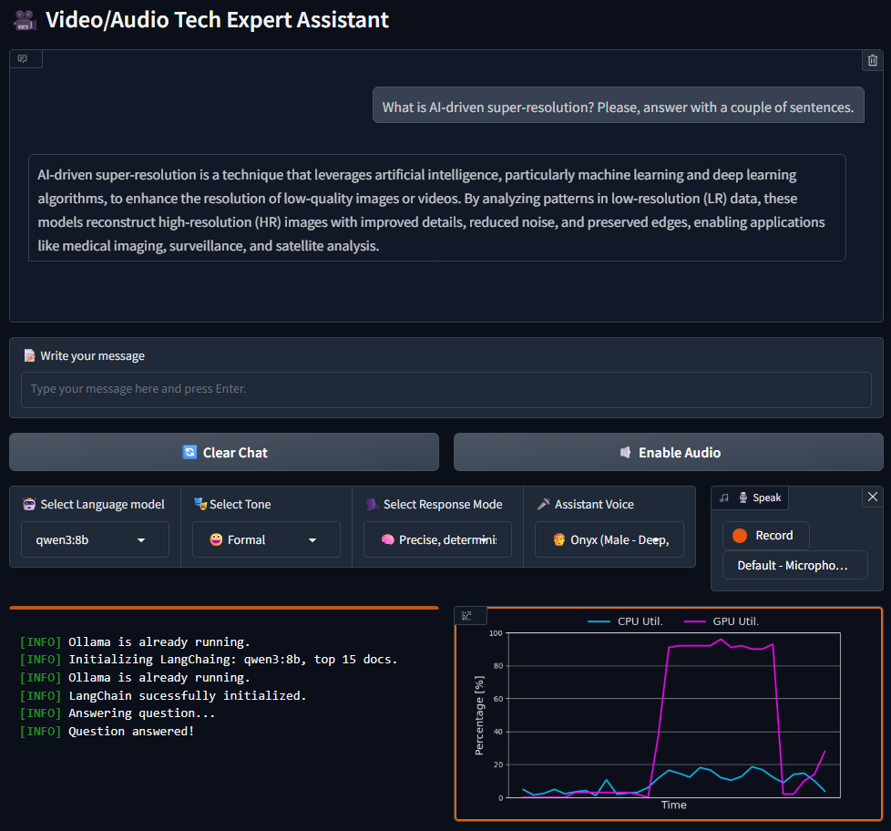

  

# AI-Powered Expert Assistant on Video & Audio Technologies

By [Sergio Sanz, PhD](https://www.linkedin.com/in/sergio-sanz-rodriguez/).

This project focuses on the development of an AI-powered assistant specialized in video and audio technologies. The app uses Retrieval-Augmented Generation (RAG) to accurately answer domain-specific questions and help me search for relevant research papers within private document databases.

## 1. Highlights

A quick overview of its key features is listed next:
- Flexible LLM inference: run models locally via hashtag#Ollama or in the cloud with hashtag#OpenAI
- Multi-LLM switching with automatic model detection; the app detects the LLM installed in the computer.
- Context-aware retrieval using chat history, in which the previous conversation is used to enrich current user's prompt.
- Research paper querying from private collections.
- Assistant tone selection: formal, casual, friendly, etc.
- Answer modes: creative or deterministic.
- Voice interaction powered by OpenAI's Whisper (speech-to-text) and TTS-1 (text-to-speech).
- Live monitoring: logger, CPU & GPU utilization.

## 2. The Workflow

ToDo.

## 4. Description of the User Interface

ToDo.