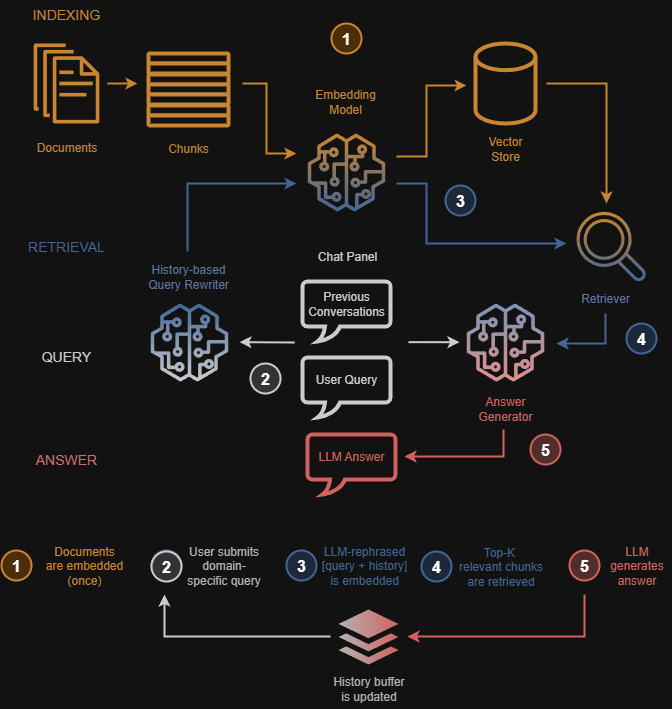
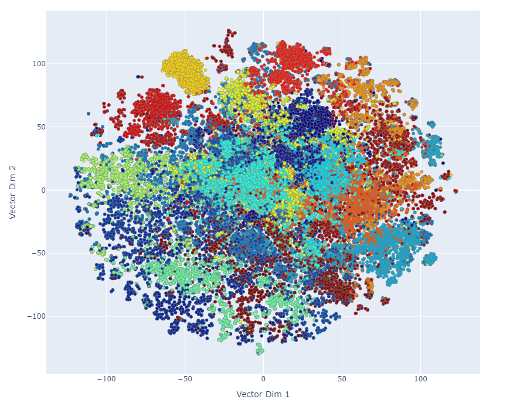

# AI-Powered Expert Assistant on Video & Audio Technologies

By [Sergio Sanz, PhD](https://www.linkedin.com/in/sergio-sanz-rodriguez/).

This project focuses on the development of an AI-powered assistant specialized in video and audio technologies. The app uses [Retrieval-Augmented Generation](https://arxiv.org/abs/2005.11401) (RAG) to accurately answer domain-specific questions and help me search for relevant research papers within private document databases.

## 1. Highlights

A quick overview of its key features is listed next:
- Flexible LLM inference: run models locally via [Ollama](https://ollama.com/) or in the cloud with [OpenAI](https://openai.com/).
- Multi-LLM switching with automatic model detection; the app detects the LLM installed in the computer.
- Context-aware retrieval using chat history, in which the previous conversation is used to enrich current user's prompt.
- Research paper querying from private collections.
- Assistant tone selection: formal, casual, friendly, etc.
- Answer modes: creative or deterministic.
- Voice interaction powered by OpenAI's Whisper (speech-to-text) and TTS-1 (text-to-speech).
- Live monitoring: logger, CPU & GPU utilization.

## 2. The Workflow

Figure 1 shows an overview of the proposed assistant. The system is composed of three stages: indexing, retrieval, and generation, which are described next.

  

  <figcaption> Figure 1: Overview of the RAG-based assistant architecture.</figcaption>

 

### 2.1. Indexing

In the indexing stage, the system prepares the document corpus for efficient semantic search:

- The entire document database is split into overlapping text chunks of 1000 characters, with a 200-character overlap to preserve context across boundaries.

- Each chunk is encoded using the [BAAI/bge-large-en](https://huggingface.co/BAAI/bge-large-en) embedding model, which transforms the text into a 1024-dimensional vector representation.

- These embeddings are then stored in [Chroma](https://github.com/chroma-core/chroma), an open-source vector database optimized for similarity search and retrieval.

This step creates the foundation for fast and relevant document retrieval during runtime.

The current version of the assistant has indexed over 26,000 documents, resulting in a total of 100,630 text chunks, each represented as a 1,024-dimensional embedding vector. This chunking and embedding strategy enables efficient semantic retrieval while preserving contextual integrity across a large and diverse corpus of technical documents. 

Figure 2 shows a 2D projection of the document embeddings, grouped by categories within the domain of video and audio processing and coding:

    

  
  <figcaption> Figure 2: Visual representation of the document corpus.</figcaption>

 

Corpus indexing is performed **once initially** and updated whenever new documents are added to the database. In other words, the indexing stage is **decoupled** from the subsequent retrieval and generation stages.

### 2.2. Retrieval
At query time, the assistant dynamically enriches and refines user input before retrieving relevant content:

- The current user query, along with the previous conversations, is fed into an LLM that performs query rewriting. This produces a context-enriched query that better reflects the user's intent.

- The rewritten query is 1024-vector embedded using the same embedding model used during indexing.

- A similarity search is performed in the Chroma vector store to retrieve the top K most relevant chunks, based on semantic closeness to the contextualized query.

This stage ensures that the most relevant pieces of information are selected for answer generation.

### 2.3 Generation
In the final stage, the system generates an informed, natural language response:

- The LLM receives the original user query, the previous conversation history, and the retrieved K chunks as input.

- Based on this combined context, the LLM generates a detailed and domain-specific answer.

- The history buffer is then updated with the user query and the LLM's response, preserving conversational continuity.

The same LLM can optionally be used for both query rewriting and answer generation, but they can also be configured separately.

### 2.4. Supported LLMs

The system supports:

- Local LLMs via Ollama: DeepSeek, Gemma, LLama, Mistral, Magistral, Olmo, Qwen, etc.

- Cloud-based models via OpenAI: gpt-4o, gpt-4o-mini,

This flexibility allows the assistant to adapt to different deployment environments and performance requirements.

## 3. Implementation
This RAG-based assistant is built using [LangChain](https://www.langchain.com/), which provides modular components for prompt management, retrieval pipelines, and LLM orchestration. LangChain facilitates the seamless integration of vector stores (Chroma), embedding models (BAAI/bge-large-en), and both local and cloud-based LLMs.

## 4. Description of the User Interface

Figure 3 shows a screenshot of the app’s Graphical User Interface (GUI). The text box at the top displays the ongoing conversation between the user and the LLM. The user types their query into the field labeled *Write your message*.

    

  <figcaption> Figure 2: A screenshot of the app’s GUI.</figcaption>

 

Users can configure the session by selecting which LLM model is responsible for rephrasing and answering the query. Additionally, the tone of the LLM’s response can be chosen from a wide range of options, including *formal*, *casual*, *friendly*, *sweet*, *sarcastic*, *snarky*, *impatient*, *condescending*, and *disrespectful*.

The response style can also be adjusted between *deterministic* (consistent, similar answers) and *creative* (more varied and imaginative replies). This behavior is configurable via the user interface.

Another notable feature is voice interaction. The app uses OpenAI’s [Whisper](https://openai.com/index/whisper/) for speech-to-text and [TTS-1](https://platform.openai.com/docs/guides/text-to-speech) for text-to-speech. The voice’s tone and gender can also be configured by the user.

The GUI includes a live monitoring system: on the bottom-left, a text box displays logging information during the session, and on the right, a real-time graph shows CPU and GPU usage. The figure illustrates an LLM running locally, with high GPU utilization during response generation.

## 5. Comparing LLM Answers

Two simple but insightful questions were asked to each supported LLM:

1️⃣ Based on the information in the provided documents (RAG),

2️⃣ Based on your internal knowledge (i.e., training data),

➡️ which video technology is most likely to have significant impact in the near future?

The model responses are summarized in Table 1.

  

  
  <figcaption> Table 1: Responses from different LLMs regarding high-impact video technologies.</figcaption>

 

As observed, most models identified Versatile Video Coding (VVC) as the most impactful advancement, followed by AI-driven video compression and the 8K format.

While other transformative technologies—such as HDR, 5G streaming, and superresolution—were also mentioned in some outputs, the models emphasized that their success depends on the efficiency of underlying codecs to meet the demands of bandwidth, latency, and visual quality.